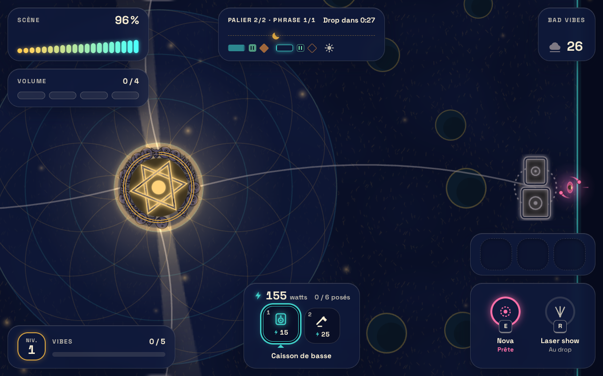
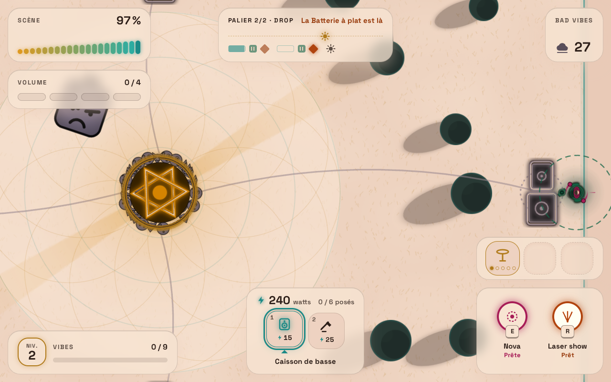

# Ozoboom

Jeu web léger de survie coopérative dans un festival de psytrance. De 1 à 4 amis défendent le sound system de la scène principale contre des vagues de bad vibes de plus en plus puissantes, chacun avec sa classe, jusqu'au lever du soleil.

Jouer : [r4mbo7.github.io/Ozoboom](https://r4mbo7.github.io/Ozoboom/)

## État

Au 2026-10-05 : la V0.1 se joue de bout en bout, seul, au clavier et à la souris ou à la manette : lumière du coucher au lever du soleil, bad vibes en masques, enceintes annexes, agrès de cirque, reliques. Le nom vient d'Ozora et de Boom, deux festivals de psytrance.





Les dix autres captures (crépuscule, sunrise, chaque écran, le banc à 300 masques) sont dans [docs/captures](docs/captures).

| Jalon      | Contenu                                                                                                                                                                                                                                    | État    |
| ---------- | ------------------------------------------------------------------------------------------------------------------------------------------------------------------------------------------------------------------------------------------ | ------- |
| Fondations | Vision, direction artistique, game design, architecture, contrats, outillage, CI et déploiement                                                                                                                                            | fait    |
| V0         | Prototype solo jouable : mage, vagues, deux pièges, clavier et manette, musique synthétisée, bouton « Ton avis » ([exigences](docs/brainstorms/2026-10-04-v0-requirements.md), [plan](docs/plans/v0.md))                                   | fait    |
| V0.1       | Direction artistique « Cycle du soleil », bad vibes en masques, enceintes annexes et Volume, agrès de cirque, raretés, fusions, reliques ([exigences](docs/brainstorms/2026-10-04-v0.1-requirements.md), [plan](docs/plans/v0.1.md))       | fait    |
| V0.2       | Trois classes, coop locale, coop en ligne par lien, pair à pair en lockstep ([exigences](docs/brainstorms/2026-10-05-v0.2-requirements.md), [plan](docs/plans/v0.2.md), [ADR 0007](docs/adr/0007-coop-en-ligne-lockstep-webrtc-peerjs.md)) | à venir |
| V1         | Tous les pièges, équilibrage, tactile, mode radio, retours des joueurs ([jalon](https://github.com/r4mbo7/Ozoboom/milestone/2))                                                                                                            | à venir |
| V2         | Classement public : soirée du jour, scores vérifiés par rejeu                                                                                                                                                                              | à venir |

## Documentation

- [Vision](docs/vision.md) : piliers et non-objectifs.
- [Direction artistique](docs/direction-artistique.md) : lumière, couleur, rythme, son, accessibilité.
- [Game design](docs/game-design.md) : boucle, classes, pièges, ennemis, contrôles, coop, classement.
- [Architecture](docs/architecture.md) : simulation déterministe séparée du rendu, contrats, organisation du code, tests.
- [Décisions](docs/adr/) : les ADR.
- [AGENTS.md](AGENTS.md) : conventions pour contribuer, humain ou agent.
- [Donner un avis](https://github.com/r4mbo7/Ozoboom/issues/new?template=feedback.yml) : une idée, un bug, un souci d'équilibrage.

## Démarrer

```bash
pnpm install
pnpm dev       # http://localhost:5173
pnpm check     # types, lint, format, tests, build
```

Node 24 et pnpm (version épinglée dans `package.json`). `pnpm exec playwright test` lance les tests navigateur (`pnpm exec playwright install chromium` la première fois).

Pages de développement, une par couche : [rendu](https://r4mbo7.github.io/Ozoboom/dev/render.html), [entrées](https://r4mbo7.github.io/Ozoboom/dev/input.html), [audio](https://r4mbo7.github.io/Ozoboom/dev/audio.html), [interface](https://r4mbo7.github.io/Ozoboom/dev/ui.html) ; le jeu accepte aussi `?dev=fast` (set court et accéléré) et `?dev=bench` (300 masques sur la rive du lac, trois agrès et une enceinte branchée, coût par image dans la console et `window.ozoboom.report`).

## Licence

[MIT](LICENSE).
